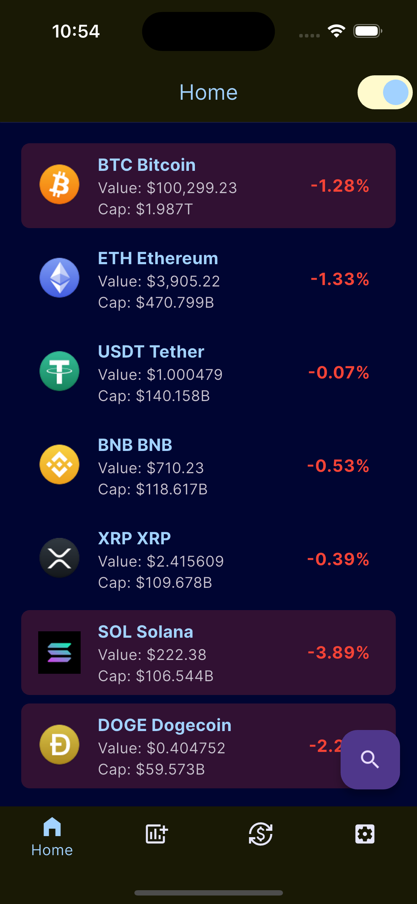

# Crypto Mobile App Portfolio

Welcome to my portfolio app! This Flutter application is a cryptocurrency tracking platform that showcases my skills in mobile development, UI/UX design, and integration of live cryptocurrency data.

## Screenshots

### Home Screen and Demo GIF
<div style="display: flex; justify-content: space-around;">
  
  
</div>


## Features

- **Cryptocurrency List**: Displays a list of cryptocurrencies with real-time market data (price, market cap, price change).
- **Search Functionality**: Search for any cryptocurrency and view its details.
- **Animated Search Bar**: A smooth animated transition when toggling the search bar.
- **Dynamic Backgrounds**: The background color of each cryptocurrency item changes based on its value.
- **Data Display**: Showcases detailed information such as name, value, price change, and market cap for each asset.
- **Charts**: View historical data of cryptocurrency prices in a line chart format.

## Technologies Used

- **Flutter**: A UI toolkit for building natively compiled applications for mobile.
- **GetX**: State management for Flutter, used for managing the app’s state.
- **CachedNetworkImage**: Used for efficiently displaying images of cryptocurrency assets.
- **Fl_chart**: Used for displaying interactive and customizable charts.
- **crypto_mobile Package**: Fetches live cryptocurrency data.
  
## Installation

1. Clone this repository:
   ```bash
   git clone https://github.com/yourusername/crypto_mobile.git
